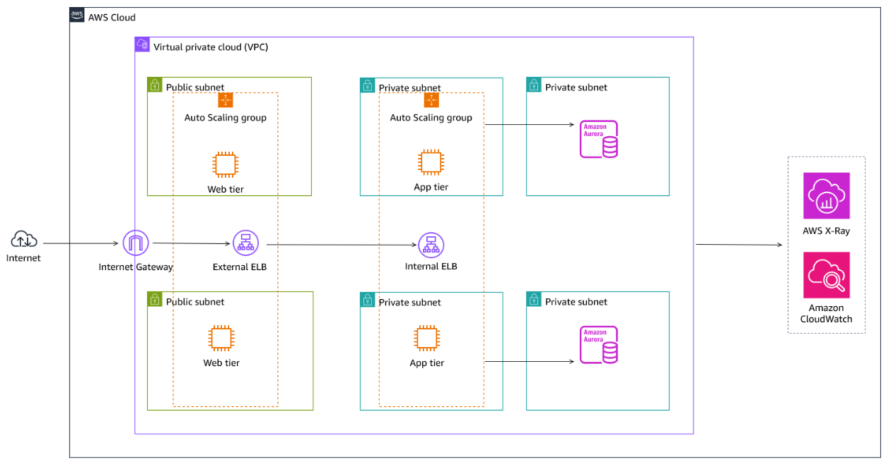
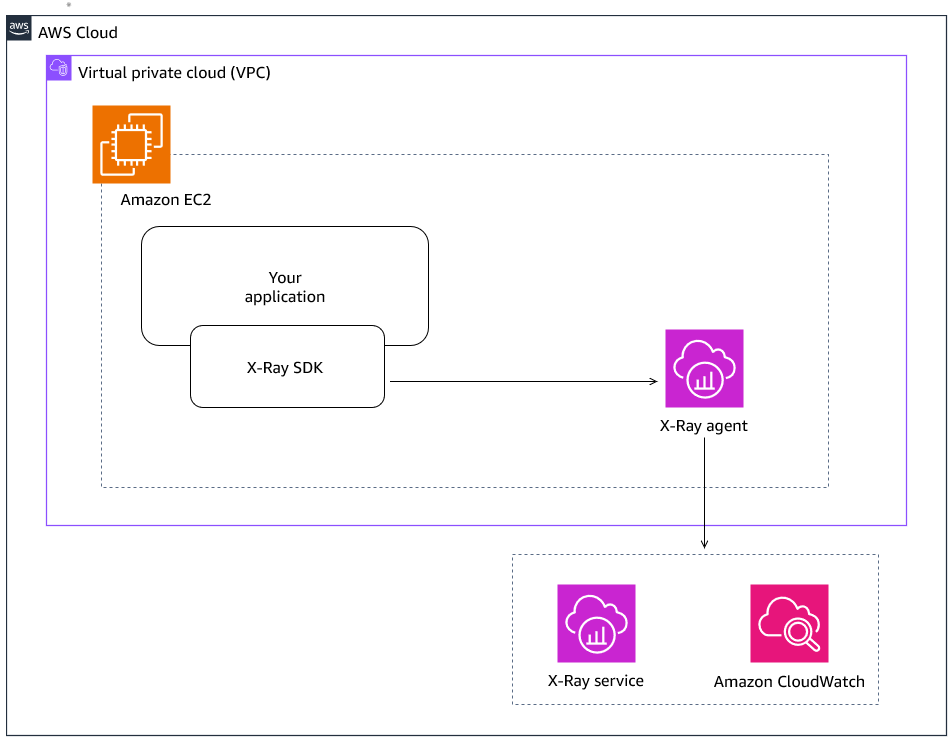

# AWS Monitoring Microservice Architectures with AWS X-Ray and Amazon CloudWatch

## Overview

This repository documents the implementation of distributed tracing and monitoring for a microservices-based application using AWS X-Ray and Amazon CloudWatch.

The lab demonstrates how to instrument Python Flask applications, collect trace data, visualize service dependencies, and analyze end-to-end request performance.

## Architecture

### Three-tier Application Architecture

The application consists of a three-tier architecture deployed in Amazon EC2 instances behind Application Load Balancers, with Amazon Aurora as the backend database.

---

### AWS X-Ray Instrumentation

The application is instrumented with the AWS X-Ray SDK. Trace data is collected by the X-Ray daemon running on each EC2 instance and sent to AWS X-Ray and Amazon CloudWatch for distributed tracing and application performance monitoring.

---
## Services Used
## Objectives
## Environment
## Configuration
## Results
## Lessons Learned
