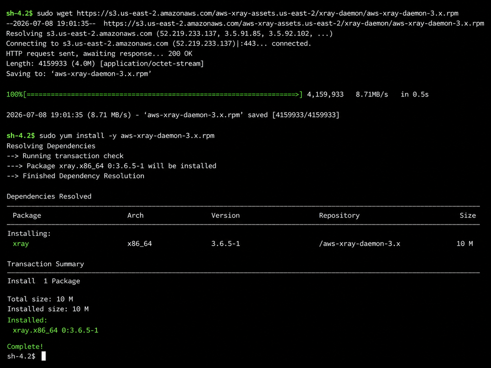
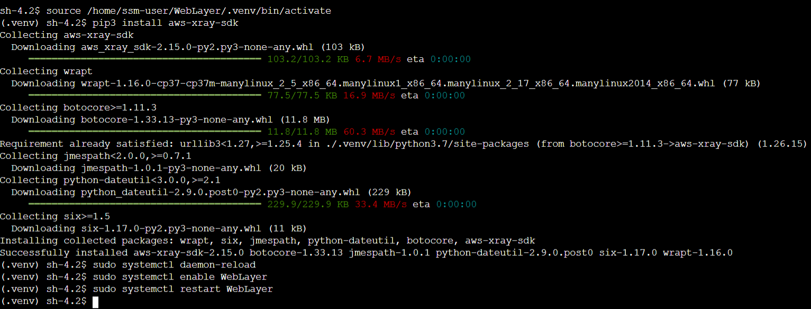
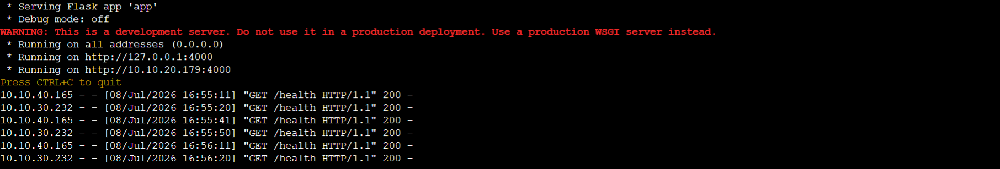
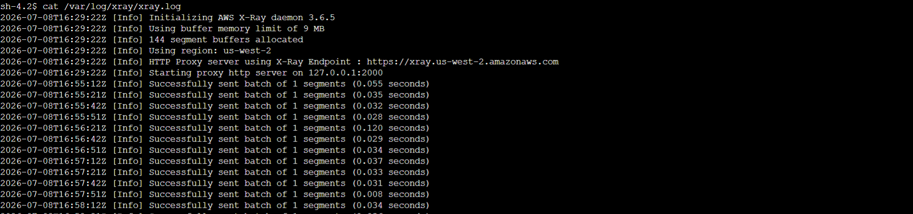
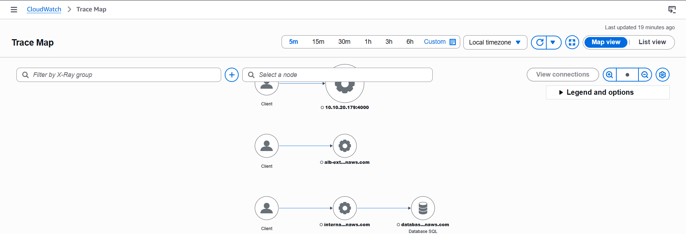
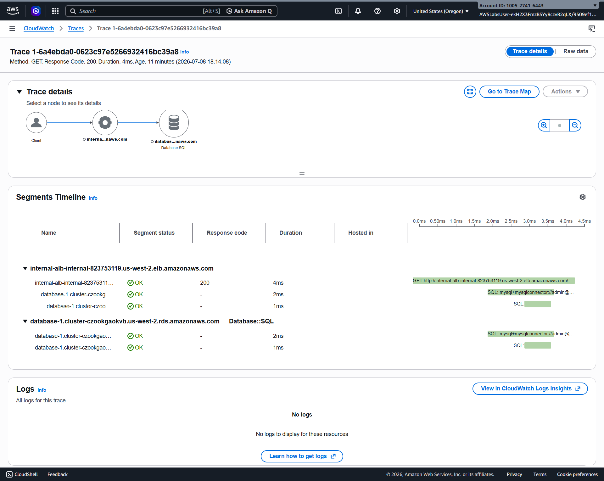
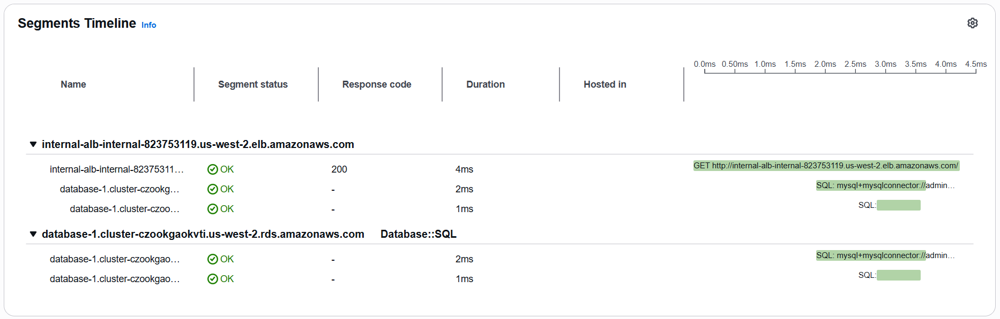
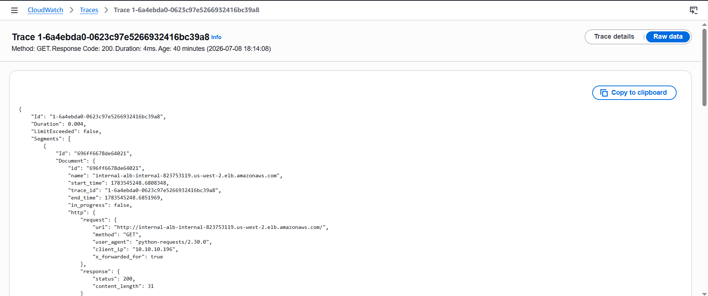

# AWS Monitoring Microservice Architectures with AWS X-Ray and Amazon CloudWatch

## Overview

This repository documents the implementation of distributed tracing and monitoring for a microservices-based application using AWS X-Ray and Amazon CloudWatch.

The lab demonstrates how to instrument Python Flask applications, collect trace data, visualize service dependencies, and analyze end-to-end request performance.


## Architecture

### Distributed Tracing Architecture


The application consists of a three-tier architecture deployed in Amazon EC2 instances behind Application Load Balancers, with Amazon Aurora as the backend database.

---

### AWS X-Ray Instrumentation


The application is instrumented with the AWS X-Ray SDK. Trace data is collected by the X-Ray daemon running on each EC2 instance and sent to AWS X-Ray and Amazon CloudWatch for distributed tracing and application performance monitoring.

---


## X-Ray Instrumentation

The application was instrumented by:

- Importing the AWS X-Ray SDK
- Configuring the X-Ray recorder
- Creating the Flask middleware
- Patching SQLAlchemy to trace database calls
- Wrapping the Flask application with the X-Ray middleware

This instrumentation enables end-to-end distributed tracing, allowing AWS X-Ray and Amazon CloudWatch to capture request flows, service dependencies, and performance metrics across the application.


## Installing the AWS X-Ray Daemon

The AWS X-Ray daemon was installed on the EC2 instance to collect trace data from the instrumented application and forward it to AWS X-Ray.

```bash
sudo wget https://s3.us-east-2.amazonaws.com/aws-xray-assets.us-east-2/xray-daemon/aws-xray-daemon-3.x.rpm
sudo yum install -y aws-xray-daemon-3.x.rpm
```

The installation completed successfully:

```text
Installed:
  xray.x86_64 0:3.6.5-1

Complete!
```




## Installing the AWS X-Ray SDK

The AWS X-Ray SDK was installed to enable distributed tracing within the Python Flask application.

```bash
export AWS_DEFAULT_REGION=$(curl -s 169.254.169.254/latest/dynamic/instance-identity/document | grep -i region | awk -F\" '{print $4}')
pip3 install aws-xray-sdk
```

```bash
Installing collected packages: wrapt, aws-xray-sdk
Successfully installed aws-xray-sdk-2.15.0 wrapt-1.16.0
```


## Configuring the Web Layer

Activate the Python virtual environment, install the AWS X-Ray SDK, and restart the Web Layer service.

```bash
source /home/ssm-user/WebLayer/.venv/bin/activate
pip3 install aws-xray-sdk

sudo systemctl daemon-reload
sudo systemctl enable WebLayer
sudo systemctl restart WebLayer
```

The AWS X-Ray SDK was successfully installed in the virtual environment, and the Web Layer service was restarted to apply the instrumentation.

```text
Successfully installed aws-xray-sdk-2.15.0
```




## Running the Application

Start the instrumented Flask application:

```bash
python3 /home/ssm-user/ApplicationLayer/app.py
```

### Common Issues

During the first execution, a few issues were encountered and resolved as described below:

- A Python 3.7 deprecation warning from Boto3 (expected in the lab environment).
- X-Ray initialization messages before the first trace is created.
- The application failed to start because TCP port **4000** was already in use.

To identify the process using port **4000**:

```bash
lsof -i :4000
```

Example output:

```text
COMMAND  PID     USER      FD   TYPE DEVICE SIZE/OFF NODE NAME
python3  3623    ssm-user   5u  IPv4 23534      0t0  TCP *:4000 (LISTEN)
```

Terminate the process:

```bash
sudo kill 3623
```

After releasing the port, restart the application using the same command shown above.

### Expected Output

```text
* Serving Flask app 'app'
* Debug mode: off
WARNING: This is a development server. Do not use it in a production deployment.
* Running on all addresses (0.0.0.0)
* Running on http://127.0.0.1:4000
* Running on http://10.10.20.179:4000

10.10.40.165 - - "GET /health HTTP/1.1" 200 -
10.10.30.232 - - "GET /health HTTP/1.1" 200 -
```

The successful `/health` responses confirm that the application is running and responding to health check requests.




## Verifying the X-Ray Daemon

Verify that the AWS X-Ray daemon is running and successfully forwarding trace segments:

```bash
cat /var/log/xray/xray.log
```

Example output:

```text
2026-07-08T19:01:37Z [Info] Initializing AWS X-Ray daemon 3.6.5
2026-07-08T19:01:37Z [Info] Using region: us-west-2
2026-07-08T19:01:37Z [Info] Starting proxy http server on 127.0.0.1:2000
2026-07-08T19:52:09Z [Info] Successfully sent batch of 1 segments (0.058 seconds)
```

The successful **"Successfully sent batch of 1 segments"** message confirms that the X-Ray daemon is receiving trace data from the application and forwarding it to AWS X-Ray.




## Trace Analysis


### Trace Map

The AWS X-Ray Trace Map provides an end-to-end visualization of the application's request flow and service dependencies.

It enables developers to:

- Visualize communication between application components.
- Identify service dependencies and request paths.
- Detect latency bottlenecks and performance issues.
- Monitor distributed requests across the application stack.




### Trace Details

The **Trace Details** view provides detailed information about an individual request captured by AWS X-Ray.

It allows you to:

- Inspect the complete execution path of a single request.
- View request metadata, including HTTP method, response code, and execution time.
- Analyze interactions between application components and downstream services.
- Identify latency and performance issues within a specific trace.




### Segments Timeline

The **Segments Timeline** provides a detailed breakdown of the execution time for each segment and subsegment within a single request.

It enables you to:

- Analyze the execution order of application components.
- Measure the latency of individual services and database calls.
- Identify performance bottlenecks in distributed requests.
- Understand how the total request duration is distributed across the application.




### Raw Trace Data

The **Raw Trace Data** view displays the complete JSON representation of a captured trace.

It provides detailed information about the request, including:

- Trace and segment identifiers.
- Request metadata and response status.
- Service and database interactions.
- Segment and subsegment details.
- Timing information for distributed requests.

This raw data is useful for troubleshooting, validating instrumentation, and performing advanced trace analysis.




## Services Used

## Services Used

- Amazon EC2
- AWS X-Ray
- Amazon CloudWatch
- Elastic Load Balancing (Application Load Balancer)
- Amazon Aurora (MySQL)
- Python Flask
- AWS X-Ray SDK


## Lessons Learned


## Lessons Learned

During this lab, the following concepts were explored:

- Instrumenting Python Flask applications with the AWS X-Ray SDK.
- Installing and configuring the AWS X-Ray daemon.
- Monitoring distributed applications with Amazon CloudWatch.
- Visualizing service dependencies using the X-Ray Trace Map.
- Analyzing request latency through Segments Timeline.
- Inspecting raw trace data for troubleshooting and performance analysis.


## Author

**Ze Mendes**

Information Security Analyst with experience in Cloud Computing, Cybersecurity, Infrastructure, and IT Governance.

- GitHub: https://github.com/zcmendes
- LinkedIn: https://www.linkedin.com/in/zcmendes
